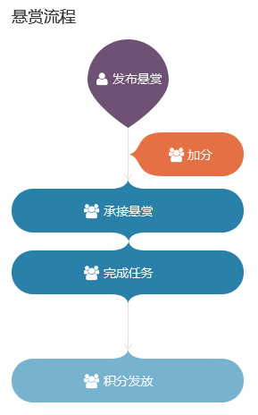

## 什么是悬赏

悬赏是CODE为开源社区提供的一套任务平台，通过需求发布和承接任务的形式来架起需求方与开发者间的桥梁。

悬赏的任务可以是跟开源相关的项目、征文、设计、比赛等内容。

需求方可以自主发布自己的悬赏需求，而有相同需求的人可以用“加分（跟投）”的方式来提高“赏金”，以鼓励更多的人参与完成任务。  

承接悬赏任务的人在任务完成后将会收到相应奖励。奖励数目由需求创建者和所有跟投者自由决定。

悬赏流程图：

更多帮助：

* [发布悬赏](https://code.csdn.net/help/CSDN_Code/code_support/FAQ_11_2)
* [给悬赏加分](https://code.csdn.net/help/CSDN_Code/code_support/FAQ_11_3)
* [承接悬赏任务](https://code.csdn.net/help/CSDN_Code/code_support/FAQ_11_4)
* [悬赏评价](https://code.csdn.net/help/CSDN_Code/code_support/FAQ_11_5)

