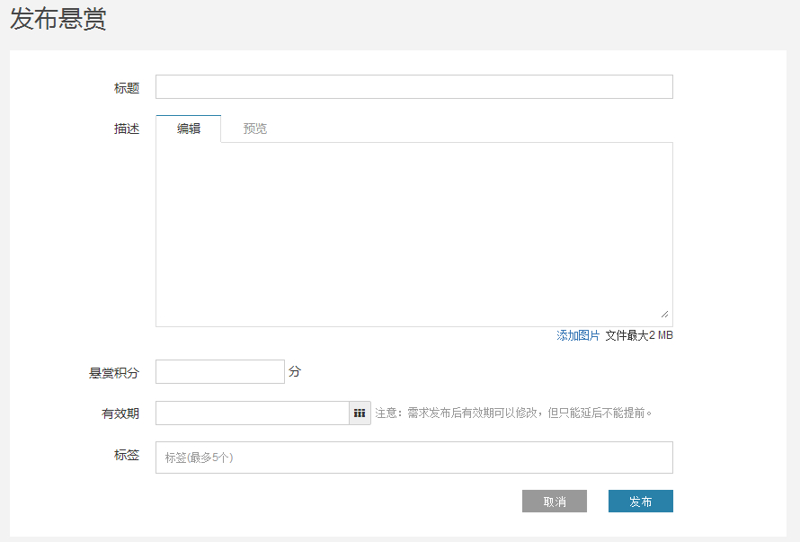

## 发布悬赏

进入CODE悬赏平台后，点击首页右侧的“发布悬赏”按钮，即可发起一个新的悬赏任务。

在弹出的发布框中依次输入以下信息：

* 标题：简要概括悬赏任务的主题
* 描述： 对悬赏任务的详细描述，支持markdown格式编辑
* 悬赏C币： 悬赏的C币，数额需要小于您的可用积分，小于50C币
* 有效期： 每个任务最长有效期为60天，在此区间内您可自由设定。

在悬赏到期之前，悬赏的发布者可以编辑悬赏，如修改悬赏描述、延长有效期等。

