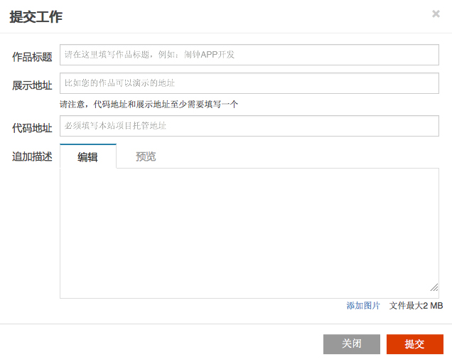

## 承接悬赏任务

在某个悬赏的详情页面，选择“承接任务”按钮，在弹出窗口里填写您对该任务的工作计划或方案，可以开始该任务的工作。填写完成后，该任务的状态将变成“工作中”。

一个悬赏任务可以由多个人承接，所有方案及工作状态都会公开的展现出来。

### 1.点击“承接任务”

### 2.填写承接方案

 

### 3.任务状态变为“工作中”

 

### 4.完成工作

成功承接任务后，在该悬赏的时间轴下方，“承接任务”的标签处变成了“完成工作”。如果你做完了这项任务，点击该按钮，在弹出窗口里填写完成情况，即可。

 

点击后在弹出窗口填写以下内容。注意：
* 对于代码类项目，项目地址必须填写CODE平台的地址。提交编号（commit id）默认为master分支的最近一次提交，用户也可以手工指定某一个提交编号。
* 对于其他类型（征文、设计），提交地址为可选

 

需要注意的是：你需要在悬赏到期之前完成工作，逾期后将不能再提交工作。

### 5.承接列表

一个悬赏任务可以由多人承接。所有承接方案的信息和状态都会公开呈现在该任务下。

 

