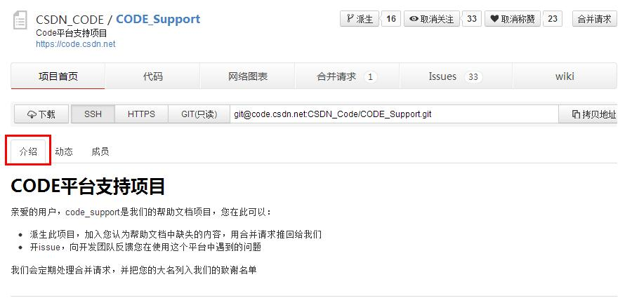

## 修改项目介绍

CODE上每个项目的首页都有一段项目介绍。这段介绍是系统自动提取自项目**README.md**文件中的内容。

如果您在创建项目时勾选了“使用README文件初始化项目”，可直接在代码中找到这个文件在线编辑。

若没有“使用README文件初始化项目”，也可以自行创建一个README.md文件。

README.md文档支持markdown格式的编写。

* [什么是markdown？](/help/CSDN_Code/code_support/new_9)