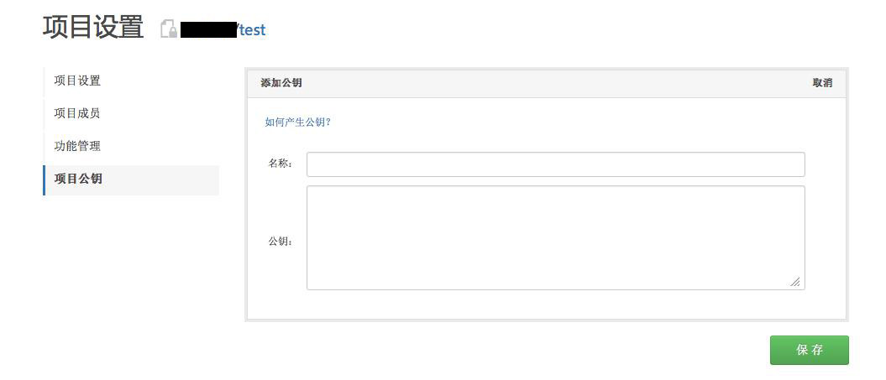

## 项目公钥

SSH协议是一种非常常用的Git仓库访问协议, 使用公钥认证、无需输入密码， 加密传输，操作既便利又保证了安全性。

我们已经介绍过用户级公钥（见[管理公钥](https://code.csdn.net/help/CSDN_Code/code_support/FAQ_2_3)），使用用户级公钥，用户可以使用SSH协议访问CODE平台上的Git仓库 。

项目公钥是为一个项目的部署服务器设置的。

如果没有项目公钥而要使用SSH协议把CODE平台的代码直接部署到服务器上或者在服务器上往CODE平台推送代码，则需要为服务器额外使用一个用户帐号。

使用项目公钥则可以直接把服务器的SSH公钥添加到项目设置中，这样该服务器就可以直接访问CODE平台的项目代码了。

一个项目可以设置多个项目公钥。

**如何添加项目公钥？**

项目在某个项目的项目设置中添加，添加方式和用户公钥相同，拷贝部署服务器的公钥并粘贴到输入窗口中然后点击“保存”即可。
 
您也可以删除已有的项目公钥，或者为项目添加多个公钥。
添加完成后，就可以从部署服务器用SSH协议来访问远端的代码仓库了。

