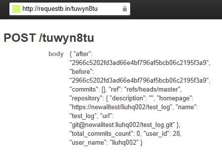

## HOOKS

当您执行push操作将更新提交到repository时，我们首先将这次push的信息和commits的内容生成一个json格式的body数据对象，然后通过发送POST请求到您的Web URL地址。

### body

我们会使用一个单独的“body”作为POST请求中的参数，参数中的commits数组部分，最早的提交在最上面，最新的提交在最下面。

下面是body数据例子：
 

### 设置
我们推荐使用 RequestBin 测试我们的WebHook, RequestBin 具体用法如下：

1、访问 http://requestb.in 点击 'Create a RequestBin'

 
2、拷贝系统提供的URL地址

3、登录CODE系统，进入目标项目的设置页面

4、点击“Hooks” 菜单

5、点击 “WebHook”子菜单项

6、粘贴您拷贝的 RequestBin URL地址并“添加”

### 测试

在您的客户端修改文件并执行 push操作，提交到CODE 系统中，或直接点击WebHook 页面的“测试Hook” 按钮。然后返回您的 RequestBin 页面并刷新，您会看到新的POST参数：

