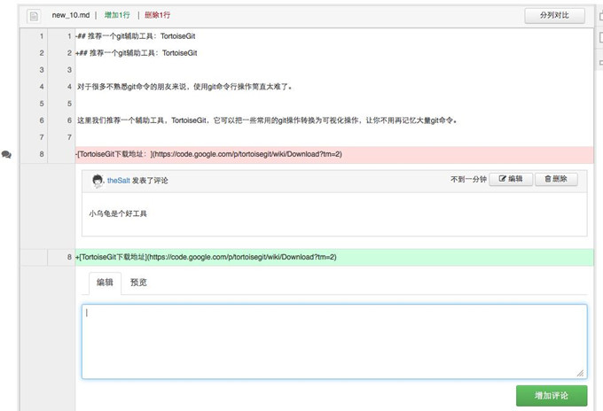

## 项目评论

### 对项目整体评论

进入项目首页，在“介绍”内容下面，您可以看到一个评论框。

直接输入内容，点击“增加评论“就可以发表您对项目的总体看法。

任何人均可对公开项目添加评论。

项目所有者和有写权限的项目成员可以管理评论内容，如删除一些恶意的评论等。

### 对单次提交评论

进入某个项目的代码页面。点击某个代码文件，点击“提交历史”。

点击“提交信息”或“提交编号”可进入该代码文件的历史提交信息页面，在页面最下方可看到评论框。

单次提交评论适用于对项目提交细节的评论。

### 代码逐行评论

在项目首页点击“代码”——“提交历史”进入某次提交的代码文件。

当鼠标指向某一行代码时，在该行代码的左侧会浮现一个“对话气泡图标”，点击该图标，在该行代码下方会展开评论的对话框，输入您的评论内容发布即可。

