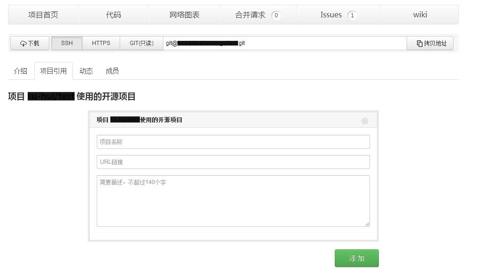

## 添加引用项目

如果您在项目开发中使用了某些开源技术，可以直接项目首页的”项目引用“中将其标注出来，让更多的人了解这些无私的开源技术，同时，也方便同样使用该技术的开发者与您交流！

### 添加“引用项目”

在项目首页，点击“项目引用“的标签，您可以添加和查看当前项目引用了哪些开源项目和开源技术。

点击“添加新项目“的绿色按钮，在弹出框中填入项目名称、项目url地址，和简单的项目描述，提交即可。

 
添加完成后的效果如下图所示：

 
### 搜索“引用项目”

我们还同步更新了CODE的搜索技术。如果您在搜索框中输入某个开源项目的名称，如 “Six”, 在搜索结果中，除了列出相关项目外，还会列出所有标注了使用“Six”开源项目的项目。

 
