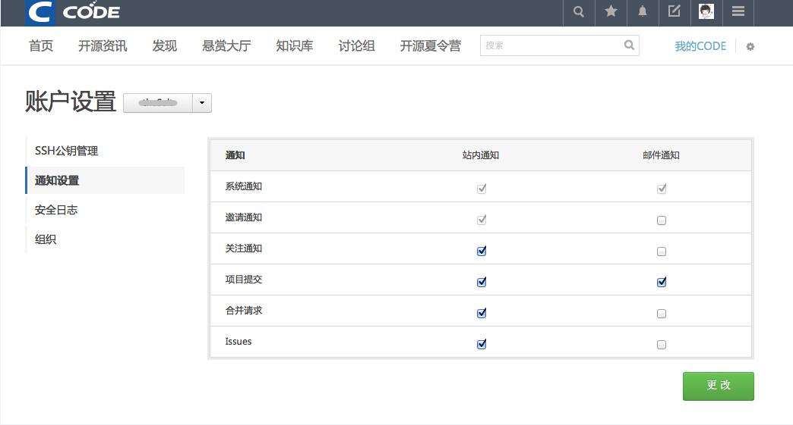

## 通知设置

在账户设置页面，点击左侧的“通知设置”标签，可以设置您接收CODE平台通知的方式。

通知提醒方式分站内通知、邮件通知两种。
除官方通知和项目邀请通知默认使用站内通知和邮件通知，且不可更改外，其他通知您均可设置接收方式及是否接收。

可自定义设置的通知包括：关注通知、项目提交通知、合并请求、Issue通知。

设置方式：勾选通知方式后点击“更改”按钮即可。

比如，你想每次git push都收到邮件提醒，就可以勾选“项目提交通知”的“邮件通知”功能。如图：

