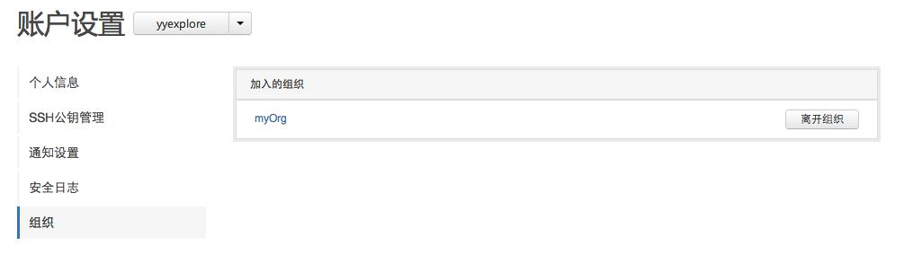

## 组织的创建与删除

对于很多企业和团队来说，拥有统一的组织账号，对项目和开发团队进行统一管理是很有必要的。CODE平台支持用户自行创建组织账号。

一个组织可以创建多个项目， 也可以建立多个团队，其中每个团队都被赋予一定的项目权限，针对不同的项目，不同的团队将会有读写、只读等权限的区分。组织中的成员可以属于不同的团队。

组织帐号是不能单独登陆的，组织的创建者和管理员登录后可以切换到组织进行管理。

**什么样的人需要使用组织？**

* 大型的开源项目
* 企业
* 大型的开发团队

### 创建组织

在CODE顶栏右侧的快捷方式中您可以发现“创建组织”的选项。

一个用户可以创建多个组织。
其中组织的名称是必填项，它必须是唯一的，支持字母、数字和下划线，不能使用中文。
这一名称将被用在组织访问的url和项目的命名空间。
您还可以为组织添加公开邮箱、微博、QQ、主页、组织介绍、头像等信息，这些是可选项。

### 删除组织

只有组织的创建者拥有对组织的删除权限。

在“组织设置——组织信息“页面最下方，创建者可以见到如下图所示的”组织管理“界面，您可以在此修改组织名称、删除组织等。需要注意的是，这两项操作都有极大风险，请谨慎处理。

### 离开组织

如果您由于某种原因想离开一个组织，可在个人的帐号设置中选择“组织”，这里列出了您加入的所有组织。

点击组织名称旁边的“离开组织”按钮即可离开该组织。离开后你将失去在该组织的一切权限，但之前提交的代码等内容不会被删除。

