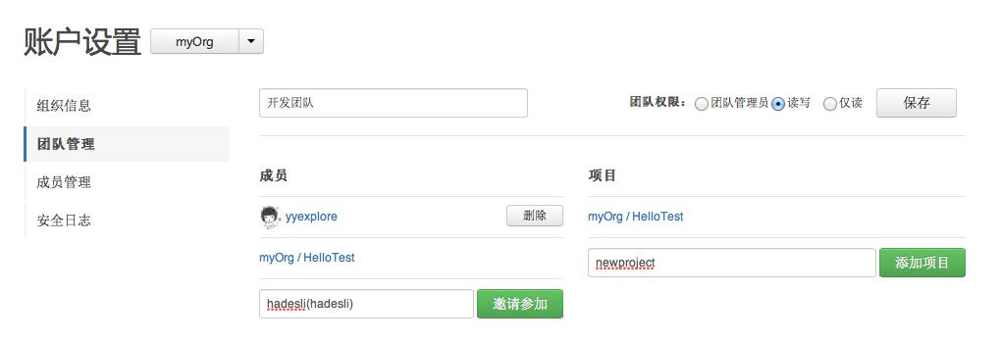

## 组织中的团队管理

团队是为了在组织中划分权限而设定的，可以理解为是对某些项目拥有一定的权限的人群的集合。团队分为管理员团队和普通团队。

其中管理员团队是组织中默认建立的，他可以修改组织的信息、创建及管理其他的团队（添加成员和项目）、创建及管理组织的项目。只有组织的创建者可以添加及删除管理员。

**普通团队按照权限可分三种：**

* 管理和读写权限， 像项目主人一样拥有项目的管理和读写权限，能够设置项目，如修改名称、描述信息、项目公钥等。

* 读写权限，对项目进行pull 和 push操作

* 只读权限，对项目进行pull操作。只读权限对于公开项目是没有意义的，因为默认所有人都对公开项目有读的权限。

### 创建团队

组织创建成功后将进入到组织的控制面板。您也可以从用户的控制面板切换到组织的控制面板（如下图）。

在组织控制面板，点击“组织设置”按钮，将进入“组织信息”、“团队管理”、“成员管理”、“安全日志“的设置界面。

### 添加团队成员和项目

在团队管理中，您可以看到默认已经有一个组织的管理员团队了。你可以点击新建团队，输入团队的名称，选择团队的权限，保存后就可以完成团队的创建。

接下来，就可以为团队添加成员和项目了：

* 输入您要添加的成员，点击添加，如果该成员已经加入组织则直接添加成功，如果该成员还未加入组织，您将收到提示是否邀请加入，确认后对方将收到邀请通知，对方接受后便加入到组织团队。

* 在项目选择栏中输入组织已有的项目添加到团队中，这样团队的所有成员都将拥有刚才设置的权限来访问项目了。

 

