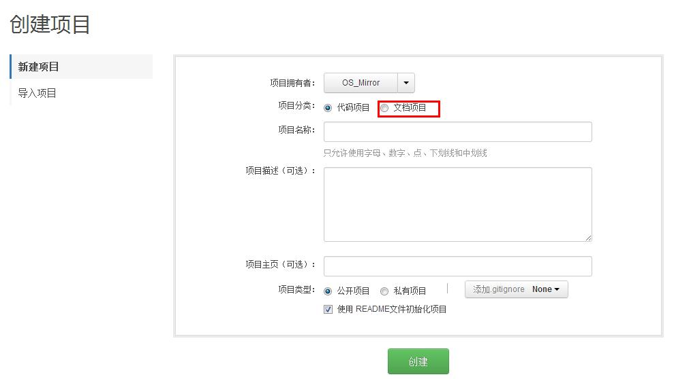
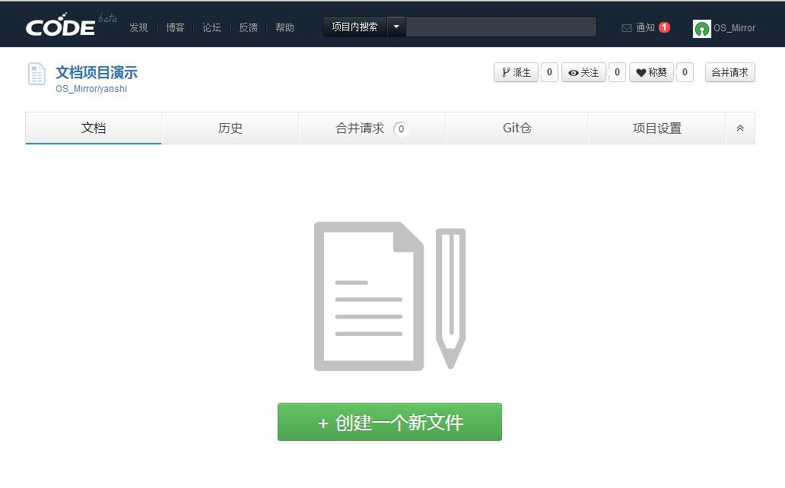
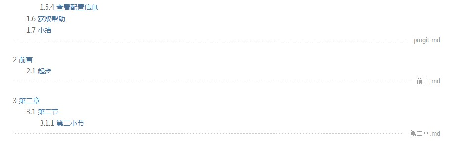
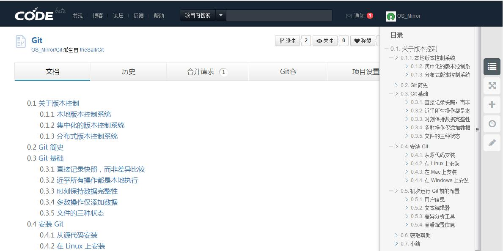

## 创建文档项目

创建文档项目的步骤和创建代码项目基本一致，只需要在创建时勾选“文档项目”的选项即可。

### 项目文件
一个文档项目中可以包含多个markdown文件。
这里需要说明的是，“文件”只是一种物理形态的存在，与该文档项目的目录调用没有直接关联。  
举例来说，如果你要写一个有十章内容的文档，你可以把这十章的内容放在同一个文件里；也可以把十章的内容分别放在十个文件里。  
系统将按内容的时间顺序，依次提取“一级标题”、“二级标题”、“三级标题”来生成整个文档项目的目录，而不管这些内容是否在一个“文件”里。  

在文档项目的首页的显示中，不同文件间的内容被用虚线+文件标题隔开。

### 自动生成目录
文档项目将根据文档内容，自动调用markdown文件的标题标签，自动生成文档目录。
同一个文件中的目录排序按照文本内容顺序提取，不同文件中的目录按照文件提交时间排序提取。

文档目录包含三级，分别依次提取“一级标题”、“二级标题”和“三级标题”。  
默认显示状态下，目录只显示一级标题列表。  
若一级标题下还有内容，该标题前面就会有一个“+”号，点击“+”号就可以展开查看其二级标题、三级标题。

显示效果如图：

