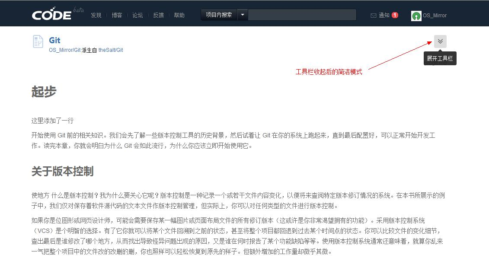
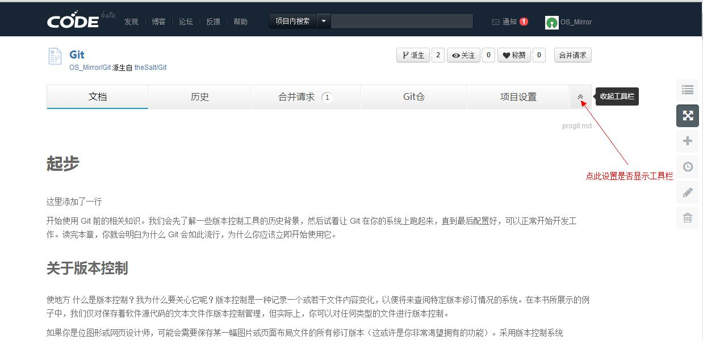
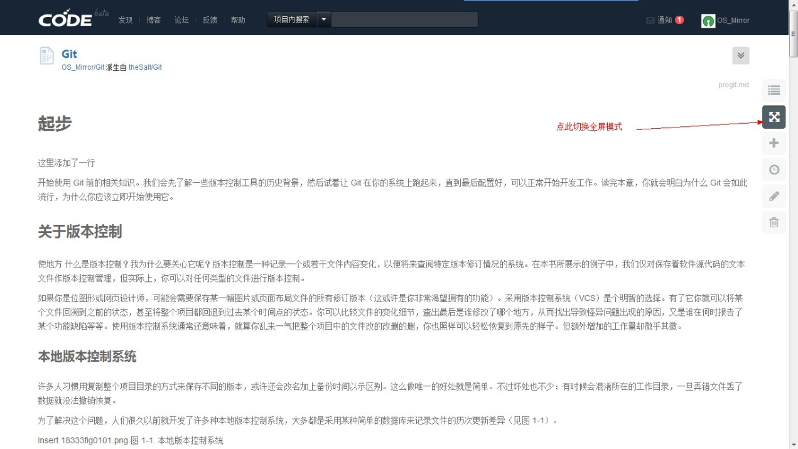

## 显示模式切换

CODE文档项目支持简洁模式、全功能模式和全屏模式展示。

### 简洁模式

默认情况下CODE文档项目以简洁模式呈现，常用的工具菜单栏悬浮在页面右侧，把更多的空间留给文字内容本身。

### 全功能模式

当你想要使用更多功能时，可以点击项目标题右侧的折叠图标，展开git版本管理相关的工具栏。

### 全屏模式

点击全屏模式切换按钮，可以将文档项目全屏展示。方便阅读。

