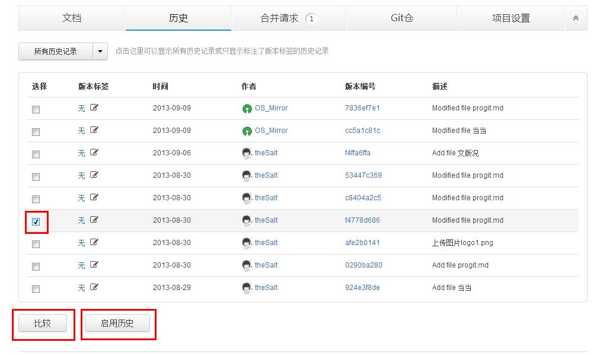
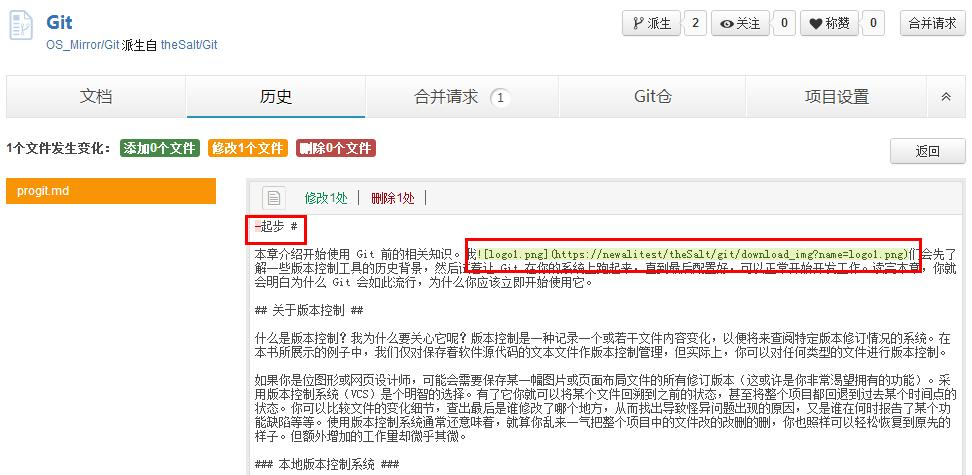
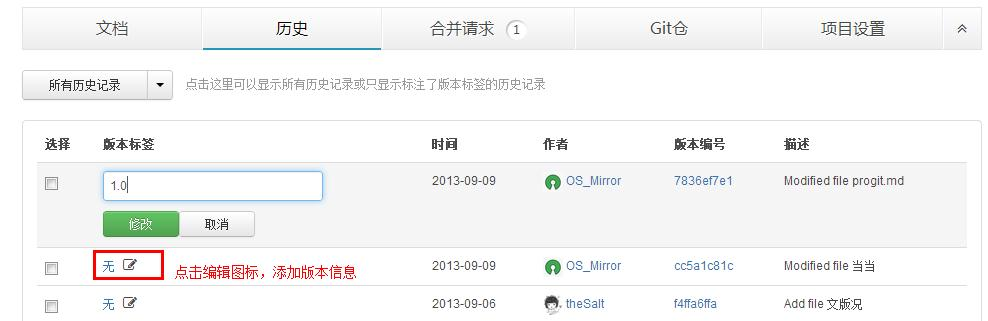
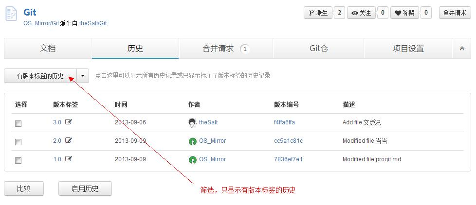

## 文档历史管理

### 查看和启用项目历史

在项目“历史”菜单下，点击文件的历史提交信息，你可以查看该文档项目的所有提交历史。

如果你想将项目恢复到之前的某个版本，只需要选中该次提交历史，点击“启用”即可。

如果后悔了，只需要重新启用恢复前的最新版本即可——也就是说，启用历史并不会将现在的内容完全覆盖。

 

### 比较任意两个历史

想要知道两次历史提交间的不同？你只需要勾选这两个版本，然后点击“比较”按钮，就可以了。两个版本间的内容差异将会被以红绿色块标示出来，页面上方的统计信息还会告诉你这两者之间共有多少处改动。

  

### 给历史添加版本信息

为了更加方便的管理文档，你可以为每次提交历史添加版本信息。添加版本信息后，在“历史”查看界面，你还可以选择“按版本查看”来筛选有版本信息的所有文件。

 

(图：添加版本信息)

(图：筛选有版本标签的历史)