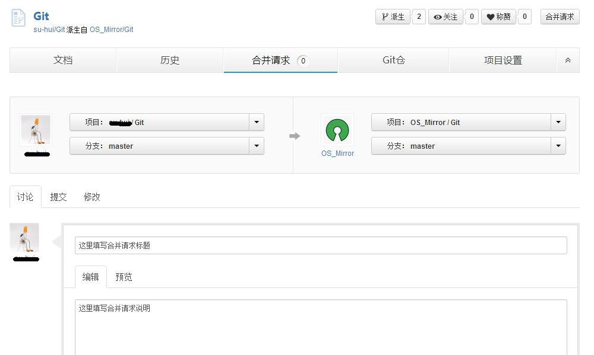
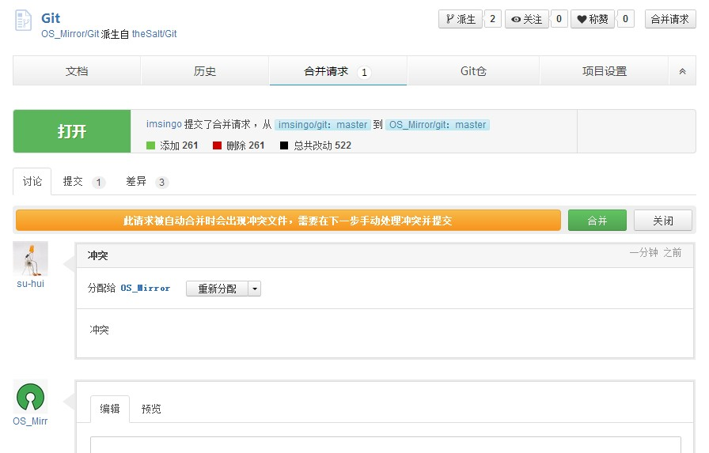
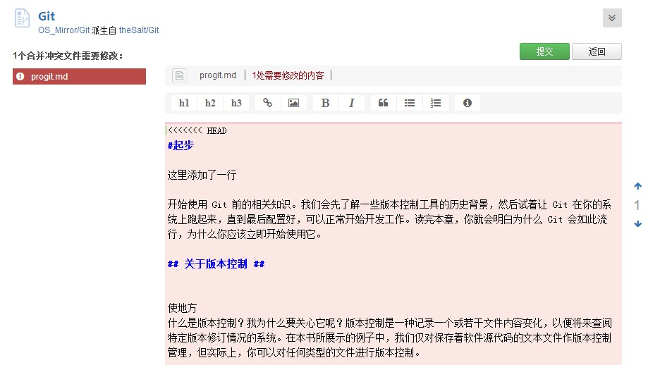

## 在线处理合并请求

文档项目目前与CODE上其他git版本项目一大不同是，它可以在线处理合并请求、在线解决冲突。这是非常实用和高效的一种社交编程处理方式，据我们所知，连github也尚不能提供在线解决冲突的功能。

### 提交合并请求

### 处理合并请求

###在线解决合并冲突

有冲突的合并请求会以橘色底色提示。如图：

点击合并之后，有冲突的内容会整个以粉色底色标示出来，你需要仔细检查并矫正其中的冲突。  
矫正完成需要保存的时候，记得把文件头部的“<<<<<<<” 和尾部“>>>>>>> ”标识的语句删除。

