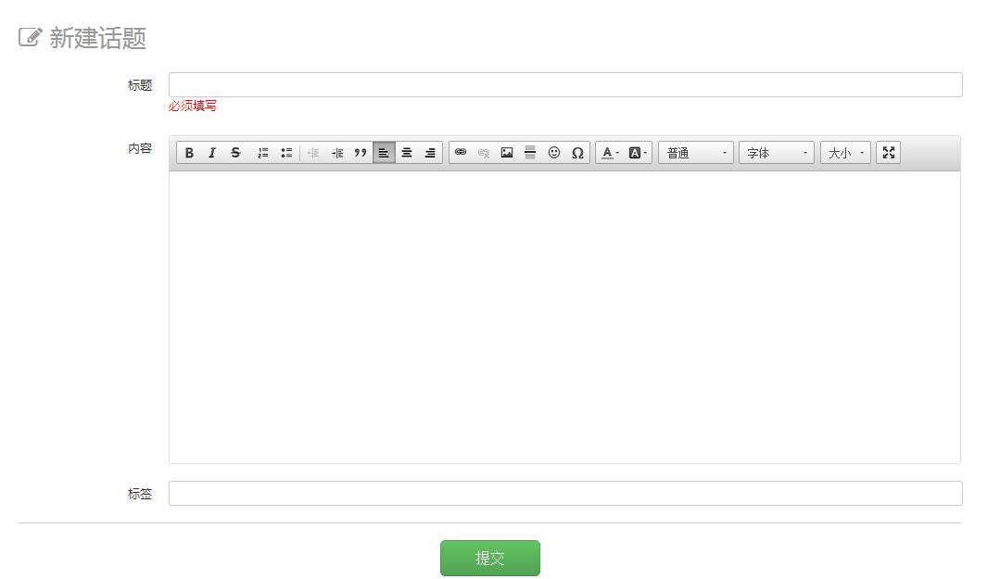
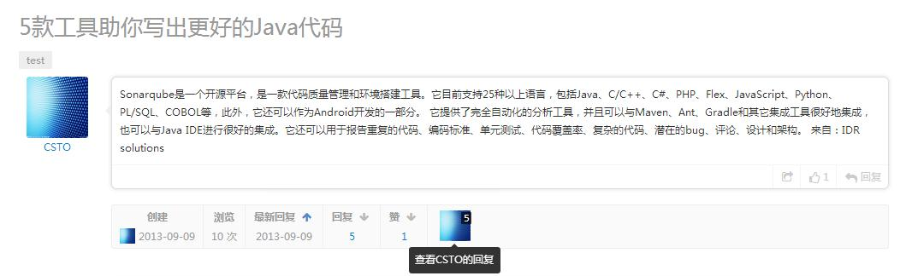
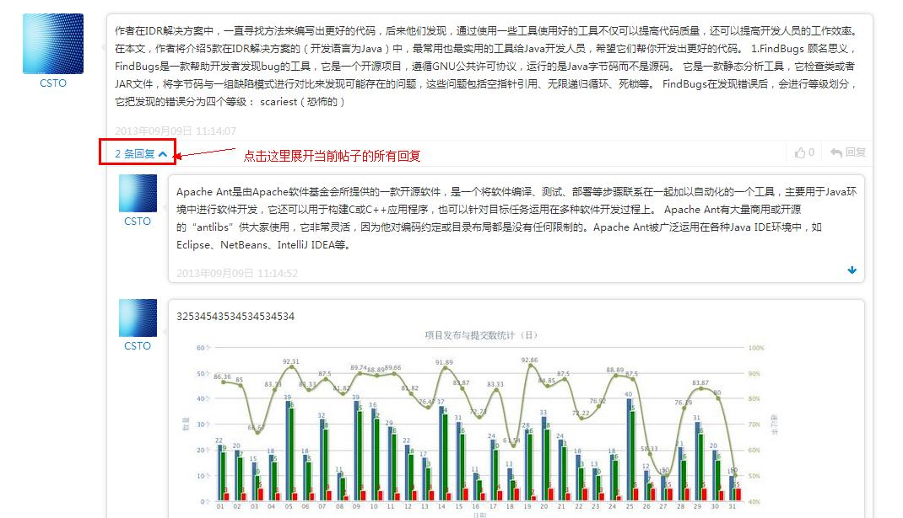

## 话题创建及管理

### 创建话题
进入你的讨论组，你可以看到关于以上操作的三个按钮，分别是“+新话题”、“+新知识”、“+新资源”。

点击“+新话题”可以创建一个新话题。填写话题标题和内容，提交即可。你还可以在话题中插入图片和超链接。

 

### 查看话题的回复

在一个话题主贴底部，我们列出了该话题基本信息（包括创建时间、浏览次数、最新回复时间、回复数量、称赞数量等）和回帖用户的头像。  
点击回帖人的头像，可以查看该用户在此话题下的所有回复。

  

如果有人对某条回复发表了评论，点击“X条回复”的按钮，你可以以树形目录结构查看该条回复的所有的评论。 

 