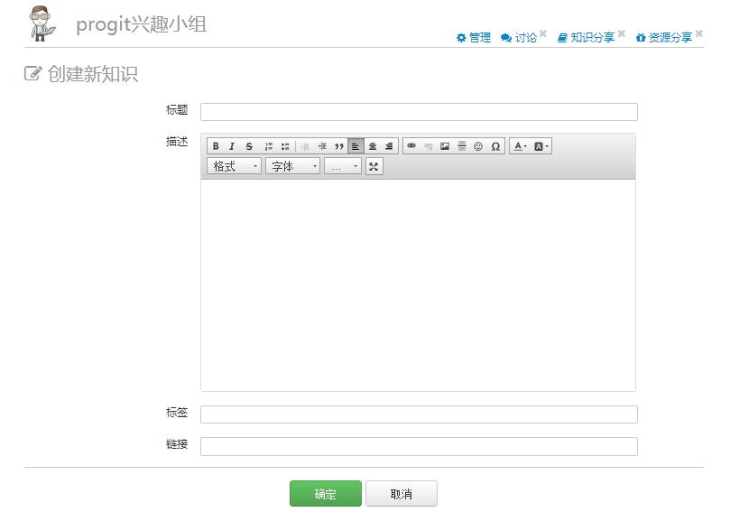
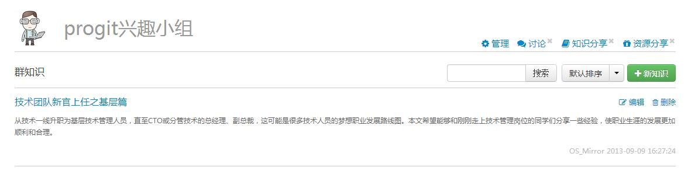

## 知识分享

在“群知识”栏目中，你可以将你在其他网站看到的有用的内容分享给讨论组的其他成员。点击“+新知识”的按钮，你将进入知识添加页面。

在标题处填写知识标题，在内容处填写知识简介（建议100字左右），然后在编辑框下方的“链接”处填写该知识的url地址。

添加完成后，知识分享的展示形式如下图所示。

 
当用户点击该条知识的标题时，将会跳转到你填写的url地址。  
需要注意的是，目前知识分享是无法回帖讨论的。  

