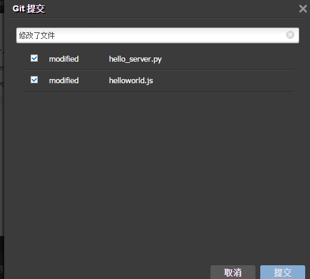

### 在CIDE里如何与CSDN-CODE托管连接？

如下图，在CIDE的菜单栏里--工具--版本管理，就可以找到【提交推送相关功能了】

但是，当你第一次使用IDE提交/推送代码时，需要先在IDE的控制台里配置下git环境，输入：

    $ git config --global user.name "CSDN id"   
    $ git config --global user.email "CSDN passport中注册邮箱"
    
如图：

然后，您就可以使用此功能，当您修改了代码，编辑了内容时，再也不怕丢失了！

