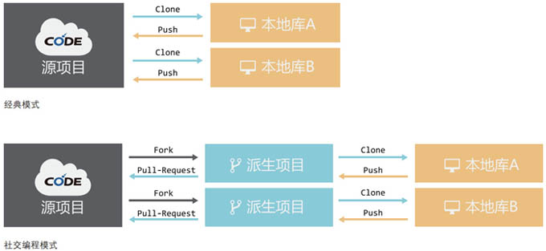

## 扫盲贴
---

>### 什么是版本管理？

每次你对文件做了修改，它就跟上一个版本不一样了。为了方便的记录文件内容的变化，以便将来查阅特定版本修订情况，我们需要使用版本管理系统来管理文件。

使用版本控制系统后，你可以明确的知道各个版本之间的变化，了解项目的进程，也方便在出现bug时找到原因。就算某天你胡来搞砸了整个项目，你也可以轻松将之恢复到原来的样子。目前已有的版本管理系统包括集中式版本管理系统和分布式管理系统等。

* [了解版本控制系统](/help/CSDN_Code/progit/zh/01-introduction/01-chapter1)

---

>### 什么是Git？

Git是一种分布式版本控制系统。Git诞生于2005年，最初由Linus Torvalds编写，用作Linux内核代码的管理。Git是完全分布式的，设计简单，对非线性开发模式拥有强力支持，有能力高效管理类似Linux内核一样的超大规模项目，有着令人难以置信的非线性分支管理系统，可以应付各种复杂的项目开发需求。

* [git基本语法](/help/CSDN_Code/code_support/new_8)  
* [详细了解git](/help/CSDN_Code/progit/zh/01-introduction/01-chapter1)

--- 

>### 什么是派生？  

派生可理解为“复制”、“克隆”。通过派生操作，你可以完整复制CODE平台任一公开项目的代码到你的用户名名下。

* [查看如何派生项目](/help/CSDN_Code/code_support/FAQ_3_1)

---

>### 什么是合并请求？  

当你派生某个项目，并在项目上做了一些修改后，如果你想把这些修改应用于“源项目”，您需要向源项目的作者提交“合并请求”，由他来把你的提交合并到源项目中。

* [如何提交合并请求](/help/CSDN_Code/code_support/FAQ_3_3)  
* [如何处理合并请求](/help/CSDN_Code/code_support/FAQ_4_2)  

---

>### 什么是代码片？ 

代码片就是一段代码。它可能属于某个软件项目的一部分，也可能是一种算法，甚至只是一两句代码。
除了托管完整的软件项目，CODE还可以进行代码片托管操作。

* [代码片的创建及管理](/help/CSDN_Code/code_support/FAQ_6_11) 

---

>### 什么是wiki？

wiki是一个项目的知识管理系统，一般来说，用于存放项目的介绍、用户手册、功能说明等内容。

在CODE平台，项目wiki除了支持在线编辑外，还可以作为一个git仓库来单独管理。您可以像管理git项目仓库一样使用git命令对wiki数据进行克隆和访问。

* [wiki的创建及管理](/help/CSDN_Code/code_support/FAQ_2_5)

---

>### 什么是markdown？

Markdown 是一种轻量级的标记语言，由John Gruber和Aaron Swartz创建，使其成为可读性最大并可再发行的可输入输出的格式。

CODE平台上，项目的README文件和wiki都是Markdown格式的，文件后缀名为.md。 

* [查看markdown基本语法](/help/CSDN_Code/code_support/new_9) 

---

>### 什么是issue？  

除了直接参与项目的代码编写，你还可以通过为项目提意见和建议来参与项目。把你发现的bug、或者新的功能想法等通过Issue的方式提交给项目作者，也许下一个版本你的想法就被采纳了！

* [Issue的提交及处理](https://newalitest/help/CSDN_Code/code_support/FAQ_3_8)

---

>### 什么是社交编程？  

社交编程是利用群体的智慧来进行合作编程的一种工作模式。这种模式采用派生/合并请求方式，让任何一个开发者都可以方便的向开源项目贡献代码。这也是一种优秀的代码评审机制，使得开发者之间的协作与交流变得顺畅而灵活，开发工作更加高效。

如图为社交编程的两种基本工作方式：

---  

>### [推荐一个git辅助工具：TortoiseGit](/help/CSDN_Code/code_support/new_s_7)  

这个工具可以将一些git常见操作换位可视化的执行，适合对git命令不太熟悉的新手。