## Eclipse配置Git 

1、 在Eclipse菜单中选择Help——Install New Software。

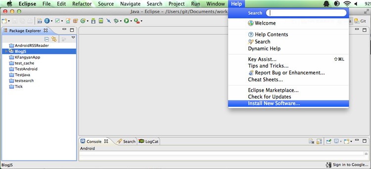

2、 在新弹出的窗口，点击Add，然后填写git插件的名字以及路径。

 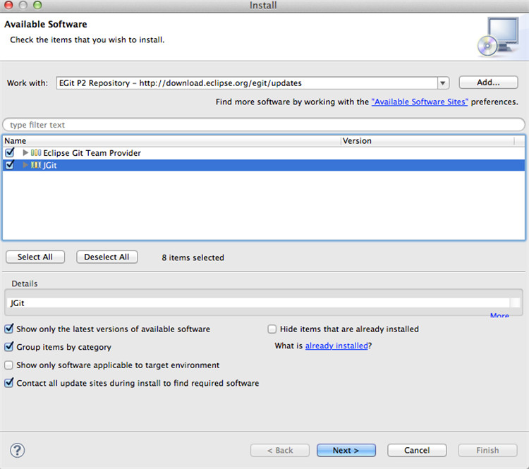

然后打勾要安装的插件，点击Next直至完成安装。

4、 重启Eclipse，再右上角可发现Git的视图。

 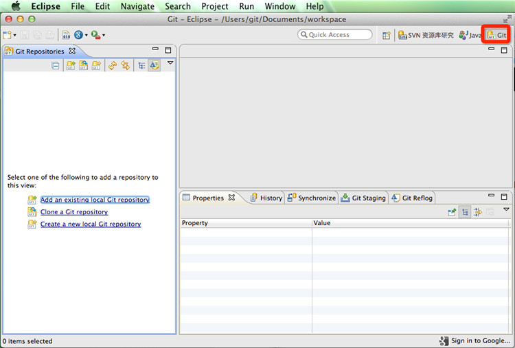

5、切换到Git视图——选择Clone a git repository，在弹出窗口中填写你要Clone的CODE项目的URL(以 .git 结尾的地址)。

Host和Repository Path会自动填充，接着填写自己的CODE用户名和密码。

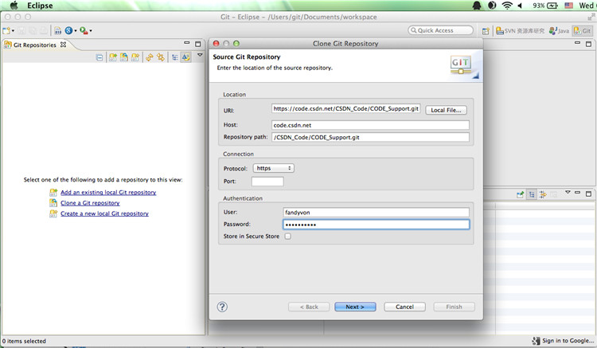

点击Next，将会看到该项目的分支。勾选分支，继续Next。

 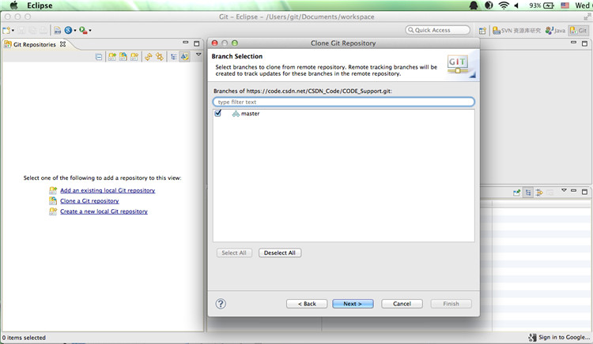

在弹出窗口中的directory处选择您要保存的本地路径地址

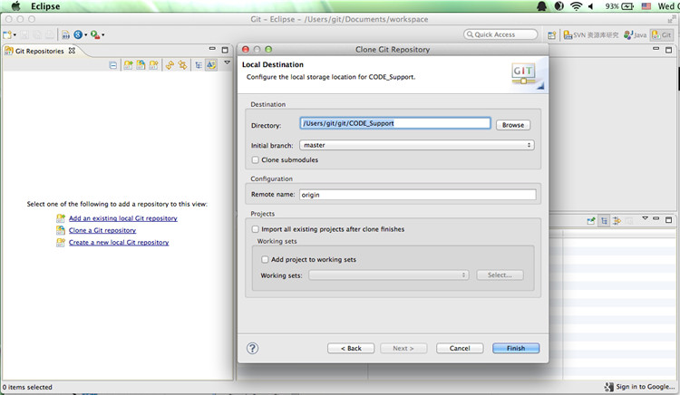

点击Finish，将会出现任务进度条。

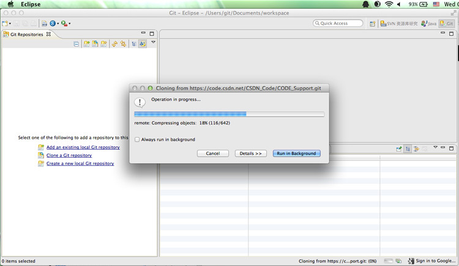

完成后，在左侧窗口你可以看到刚才克隆的项目的文件夹。

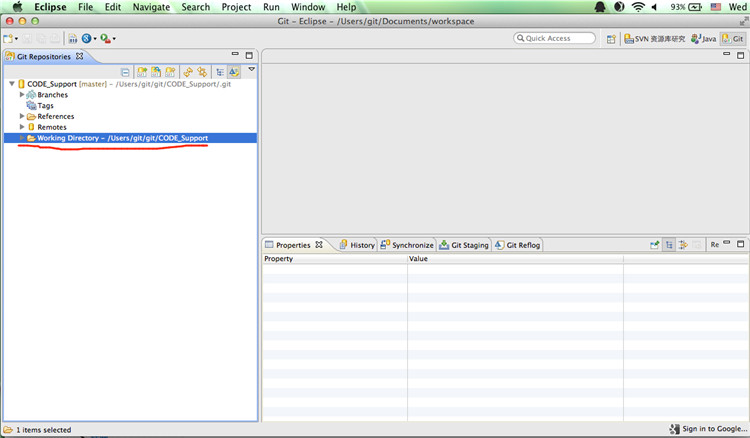

6、接下来，我们需要把这个项目加入到Eclipse的java目录下。

在左侧项目文件夹上点击右键，选择“Import projects…”

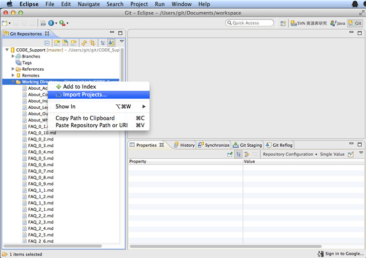

选择 imports as general project(或根据你的需求选择其他选项)

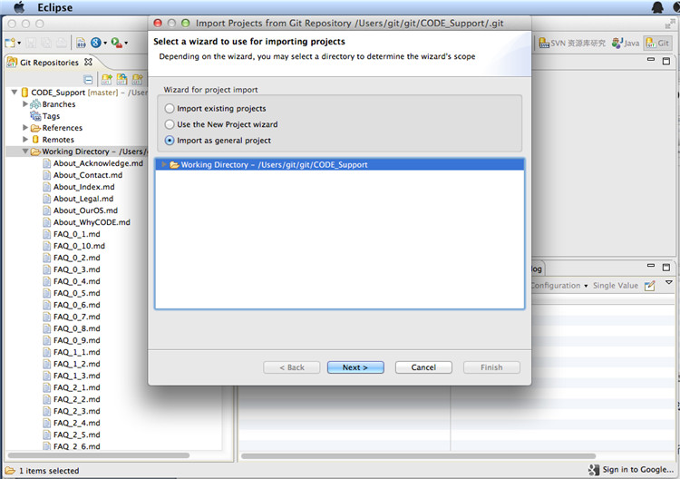

填写项目名称

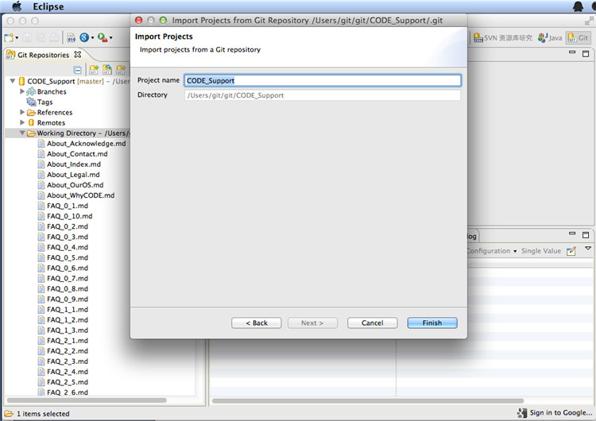

点击完成。切换到JAVA视图，你会发现该项目已经出现在了左侧窗口。

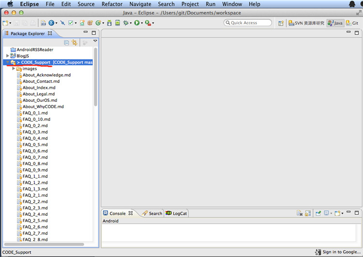

7、现在你可以对该项目进行一系列的编辑和修改工作了。

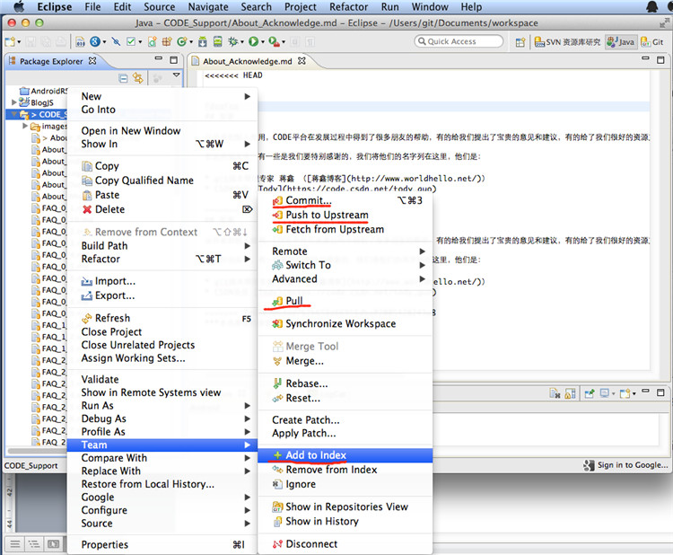

当你修改完成，需要进行Git操作时，在该项目的文件夹上点击右键，你会看到一系列菜单，分别是 commit、 push to upstream、pull 、Add to Index等，根据需求选择相应的操作就可以了。

