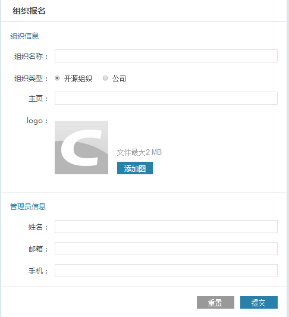
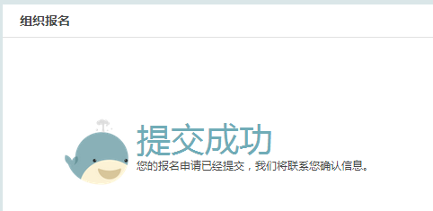
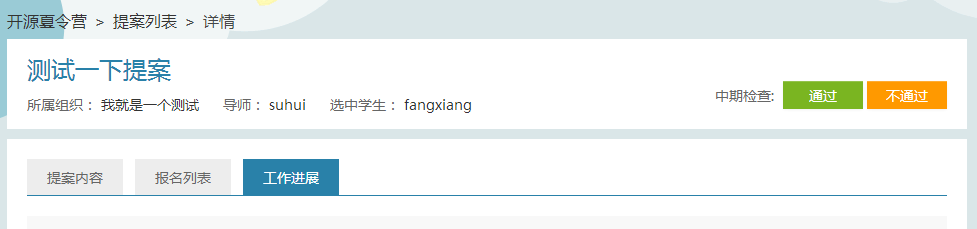

# 组织报名及操作步骤

### 1.首先请注册CSDN账号并登录

### 2.创建开源夏令营组织

进入[开源夏令营首页](http://code.csdn.net/os_camp)，点击右侧的“组织报名”按钮。

 
按照页面提示填入组织信息。其中，公司开源项目选择“公司”，非公司类项目选择“开源组织”。

注意，包括头像在内的所有信息均为必填项。主页必须以“http://”开头。

 
填写完成后，点击提交。你将会收到一个成功提示。

 
提交成功后，管理员会在后台审核您的组织是否符合要求。如有必要，管理员会电话联系您确认一些信息。通过审核后，您的组织信息会显示在“开源夏令营”首页的“参与组织”模块中。

 
此时，点击组织图标，会进入组织的主页。

### 3.邀请导师

在“开源夏令营”首页，点击最右侧的红色按钮“我的夏令营”，进入管理界面。

在组织管理界面，点击“生成邀请码”，你会得到一个链接。 

将此链接拷贝给你要邀请的导师，导师根据页面提示填写个人信息，即可加入组织。
在组织管理页面的左侧下方，你可以看到所有加入该组织的导师名单。

 

### 4.提交提案

在组织管理界面，点击“发起提案”按钮，进入提案提交页面。

 
根据页面提示填写提案信息并提交即可。

 
提交后，在组织管理界面“我的提案”标签下可以看到你所有提案的列表和审核状态。

通过审核的提案将显示在活动官网的“[精彩提案](http://code.csdn.net/os_camp/proposals)”页面。未通过审核的提案只能在自己的组织管理后台看到。

### 5.选择学生

提案通过审核后，6月16日起开始进入学生报名阶段。

学生报名后，导师可在管理后台看到所有报名本提案的学生名单，以及学生的评测成绩、开题报告等内容。

**查看学生报名情况：**

进入“我的夏令营”管理后台后，点击其中一个提案名称，将可进入提案详情页。

此时点击“报名列表”的标签，可以查看当前提案的报名情况，如图：

点击“开题报告”的标题连接可以查看学生开题报告的详情。

**为学生评分：**

导师需要根据学生的初测得分和开题报告情况给学生一个评分，评分范围在：0~100分

**选中学生：**

评分完成后，导师需要从所有报名的学生中选出一位最优的，作为该提案的最终实施者。

被选中的学生将独立完成该项目提案要求的开发工作。

### 6.指导学生：

在开发阶段，学生会把项目代码托管在CODE平台，同时，学生还会每周发布一篇项目工作报告在CSDN博客上。在后台提案详情页，点击“工作进展”的按钮，导师可以看到学生的代码托管地址和工作报告博客地址。

导师需要根据学生的开发进展，适时的给出指导和帮助，及时对学生提出的疑问进行解答。

导师与学生的沟通主要通过线上进行，双方可协商使用何种沟通工具（Email、QQ、IRC等）、沟通频次等。如果导师与学生同城，也可安排学生进行线下实习。

### 7.中期检查：

8月4日 ～ 8月8日期间，导师需要根据学生此前的工作表现和完成初期任务情况给予检查。检查结果有“通过”和“不通过”两种情况，不能通过中期考评的学生将无法拿到2000元的实习奖金。

中期考评开始后，在管理后台的提案详情页，导师将可以看到如下按钮：

导师根据实际情况选择“通过”或“不通过”即可。

### 8.最终考评：

9月8日 ～ 9月12日期间为最终考评阶段。在此阶段，学生应该完全完成了提案所要求的开发任务。

导师根据学生在工作期间的综合表现，给予考评。考评方式同中期检查。

不能通过最终考评的同学将无法拿到第二期的3000元奖金。