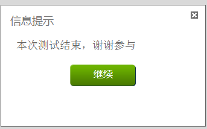

# 学生报名及操作步骤

-----

### 1.首先请注册CSDN账号并登录

### 2.报名开源夏令营

进入[开源夏令营首页](http://code.csdn.net/os_camp)，点击“学生报名”

报名要求学生先加入“CSDN高校俱乐部”，如图

点击“申请加入高校俱乐部”，进入高校俱乐部注册流程。

根据表格提示填写个人信息，并点击“加入我们”。

### 3.技能初测

成功加入“CSDN高校俱乐部”后，系统将跳转到下一个步骤：进行技能评测。测试得分将和你的开题报告一起，作为导师选择你入选夏令营的参考依据。

点击“开始测试”进入测试试题。

弹出提示窗口，点击“确定”进入试题。试题将在新的浏览器窗口中展示。**注意！不要关掉原来的窗口！**

试题是开发语言+数据结构方面的问题，整个测试时间大约60分钟。

答题完成后，在弹出窗口点击“继续”，系统将会弹出你的测试结果。你可以查看测试结果，如果对结果不满意，可以再次测试。

所有测试都完成后，请回到原来的窗口，点击“确定”进入下一个步骤。

### 3.选择提案

测试完成后，在CSDN高校俱乐部的夏令营报名页面入口，你可以看到“请选择提案”的链接，点击即可进入提案列表页。

在您感兴趣的提案后面，点击“报名参加”，即可进入报名流程。

在弹出窗口中填写你的“开题报告”。开题报告应包括你的自我推荐语、项目解决方案、实施计划和你的个人资料等内容。报告模板见[这里](http://code.csdn.net/help/CSDN_Code/code_support/oscamp_template_student_proposal)。

每个学生最多可报名两个提案。

### 4.进入实习期

提交“开题报告”后，请耐心等待导师评选过程。每个提案最终会选中一名同学进行实际开发。

被导师选中后，学生将正式进入项目开发阶段。

**将项目托管到CODE上**

学生需要将项目代码托管到CSDN CODE平台，以便导师随时关注你的开发进展和代码情况看。

**每周汇报工作进度**

学生需要在CSDN博客的个人博客中开设“开源夏令营”分类，并将分类地址提交到夏令营官网。开始实习后，学生需要每周撰写一篇博客，汇报本周的工作进展。

导师可在开源夏令营管理后台看到这些博客列表。

**保持与导师的沟通**

请在整个开发过程中保持与导师的沟通，按照导师的要求按时完成工作任务。

### 5.实习结果

8月4日 ～ 8月8日期间为中期检查阶段。9月8日 ～ 9月12日期间为最终考评阶段。导师将会在这两个阶段对你上一阶段的工作进行检查和考评。

考评结果只有“通过”和“不通过”两种情况。不能通过“中期检查”的学生将无法拿到夏令营奖金；只通过“中期检查”未通过“最终考评”的同学将无法拿到第二阶段的3000元奖金。

因此，请在两次考评前，与导师充分沟通，确保您能够按时、按质的完成导师要求。

考评结果请随时关注“开源夏令营”官网的通知和公告。