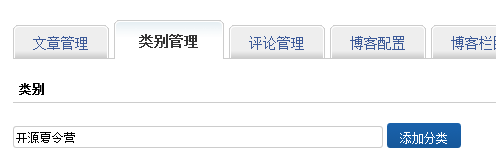

# 项目工作指导

-----

首先恭喜你成功入选“CSDN开源夏令营”！接下来，你就需要进入正式的项目开发工作了。在此之前，请先来了解一些我们的规定和要求。

### 1.项目代码必须托管在CODE平台

开源夏令营的提案项目必须将项目代码公开托管在[CSDN CODE平台](http://code.csdn.net)。步骤如下：

(1)点击页面右上角导航栏上的方形图标，在下拉菜单中选择“创建项目”，如图：

(2)在创建项目的页面，填入项目名称（英文、数字、下划线等）、项目描述等内容，点击创建。

(3)创建成功后，页面会跳转到该项目的主页，复制地址栏里的项目地址，形如“https://code.csdn.net/你的用户名/你的项目名”

(4)进入“我的夏令营”页面，在“工作进展”栏目下，项目地址的位置处粘贴上刚刚复制的项目地址。点击提交。

(5)以上几步是把你在CODE上的项目地址和夏令营提案页面做了链接，接下来具体的项目开发代码如何上传到刚刚上传的项目里，以及如何使用git版本管理工具，请看[CODE新手指南和帮助文档](https://code.csdn.net/help/CSDN_Code/code_support/new_Index)

### 2.工作进展通过CSDN博客按周汇报

开始开源夏令营的项目工作以后，你需要每周写一篇博客，向导师汇报你的项目开发进展。博客内容可以包括这段时间做了哪些工作，解决了什么问题，下一步的计划等，具体可以与导师协商。

**下面介绍一下如何设置CSDN博客。**

(1)**首先请确保你的博客和夏令营报名使用的是同一用户名！**

因为系统会根据用户名自动抓取博客信息。

如果你还没有开通博客，点击导航栏中的“写博客”链接时，系统会自动弹出页面邀请你开通博客。

**(2)新建博文分类为：“开源夏令营”**

进入你的博客，点击博客页面右上角的“管理博客”，进入博客后台，然后点击“类别管理”标签，新建一个“开源夏令营”类。

**(3)开源夏令营工作汇报博文请都发布在“开源夏令营”类别下。**

如图：发布文章时，在页面最下方的“个人分类”处，勾选“开源夏令营”。

这样，下次你查看“工作进展”时，就会发现，在工作报告处，系统自动调用了你“开源夏令营”类别下的博客。方便导师和你自己做工作回顾。