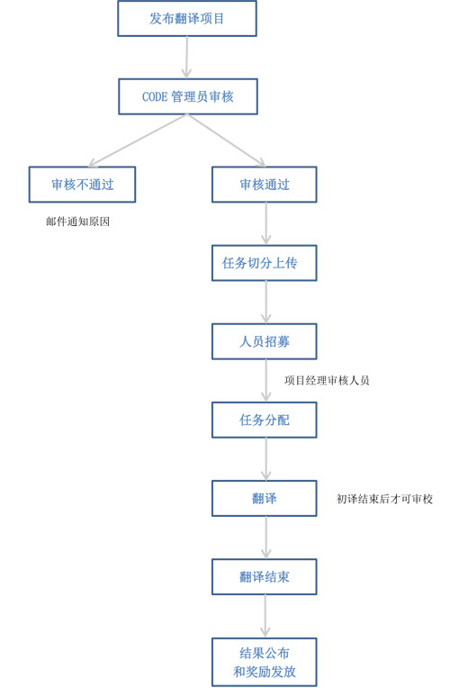

# CSDN翻译平台简介

CSDN翻译平台平台是在[腾讯基金会](http://gongyi.qq.com/jjhgy/)的大力支持和资助下、由[CSDN](http://www.csdn.net)联合[北京语智云帆科技有限公司](http://www.lingosail.com/)共同开发完成的。通过组织翻译大型技术文档，本平台致力于为开发者提供最新最全的国外技术资料，让国内技术与世界同步。

CSDN用户可直接使用CSDN账号登陆翻译平台。

网址：[http://code.csdn.net/translations](http://code.csdn.net/translations)

## 翻译内容

IT技术领域的各种文档。包括项目说明，操作指南，公开的博客和教程等。

内容来源主要是网友提交和推荐。CSDN会对网友提交的内容做基本的审核，包括内容是否合适、是否已有流通的中文译本、是否存在版权隐患等。但由于人工审核可能存在疏忽和遗漏，还请广大网友监督指正。

## 四种用户身份

在整个翻译平台中，有四种用户身份：

- **系统管理员**：负责协调项目资源，解答用户关于平台使用的问题。
- **PM（项目经理）**：负责管理项目内容，跟进项目进度，保证项目按时完成。
- **审校**：负责完成PM分配的审校任务，对翻译文档的质量负责。
- **初译**：负责完成PM分配的初译任务。

## 翻译流程

