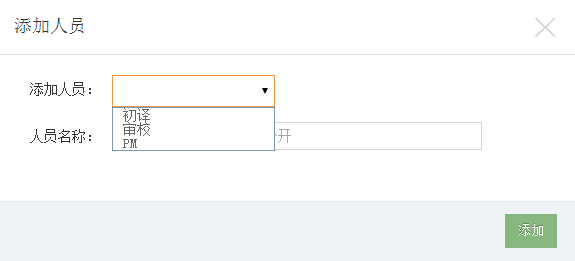
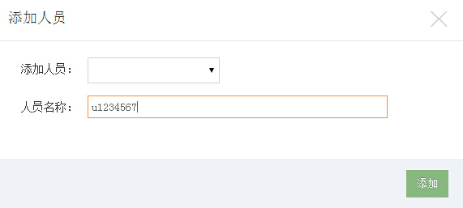

# 翻译操作指南 - PM（项目经理）

PM（项目经理）是一个项目的灵魂人物，负责一个项目的总控。主要任务包括以下几项：

- 创建项目
- 翻译素材处理
- 成员审核
- 任务分配
- 任务进度跟踪
- 积分分配

### 创建项目

系统默认翻译项目的创建者为该项目的PM。关于如何创建项目请[查看这里](/help/CSDN_Code/code_support/translate_3_0)。

### 任务切分及上传

PM需要把长篇的翻译素材切割为若干个任务文件，并上传至项目管理后台。以便为不同的译者分配不同的任务。

其中，txt可直接上传，pdf和word格式的文档需要预处理后上传。如果你的文件需要预处理，CODE管理员会提前联系你详细事宜。

**注意**：任务文件名称中不要有空格，否则很有可能造成读取错误。txt文档最好保存为UTF8格式。

**任务上传方法**：

- 点击进入已创建好的项目，依次点击“项目管理”——“任务管理”

- 在项目信息下方，点击“添加文档”按钮  

- 在弹窗中点击“选择文档们”，可批量上传文档。  

- 上传完成后，刷新项目页面，可看到你刚刚上传的文件列表。点击文件右侧的“翻译”或“审校”按钮，可以查看文件内容或格式显示有无问题。

### 成员审核

从项目详情页点击 “项目管理”-“成员管理”，可以看到所有申请加入翻译的人员请求。

（或从首页“我的翻译” — “管理项目” — “项目管理” — “成员管理”进入）

点击“√”号通过审核；点击“×”号拒绝申请。

审核通过后，操作栏的“√” “×” 图标会变为“删除”和“改变角色”。PM可以选择删除该用户或者为其重新分配角色（如从初译改为审校）。

### 任务分配

进入该项目的“任务管理”界面。点击任务列表右侧的“添加人员”按钮，可为该任务分配译者和审校。

在弹窗中“添加人员”处点击下拉菜单，选择用户身份为“初译”或“审校”。

在“人员名称”处填写要添加用户的用户名（注意不是昵称），多个用户名之间用半角；分开。

人员分配完成之后，所有人员的名单都会显示在上方项目成员处：

【注意】审校添加后有可能出现不会马上生效的情况，请联系管理员为其重新开通权限。（此问题正在解决中）

### 任务进度跟踪

PM可根据任务状态来了解项目执行情况，进度有四种状态：

- 初译未开始
- 初译中
- 初译结束
- 审校中
- 审校结束

其中，只有“初译结束”后，审校才能开始工作（但PM可以提前分配审校任务）。

### 结束项目

待所有审校任务都结束后，项目就可以结项了。此时PM可以点击项目管理页的“结束项目”按钮完结该项目。

**项目经理需要积极协调处理翻译团队中出现的各种问题，如有需要，可以请求随时CSDN CODE管理员的支援。QQ:1799042606**