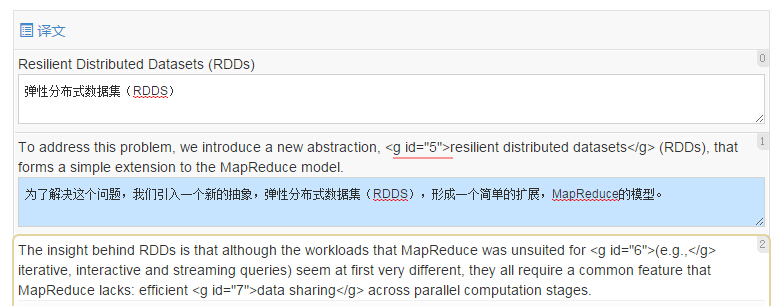

# 翻译操作指南 - 初译

### 报名

在翻译平台选择你感兴趣的项目，点击“申请加入”填写相关资料，即可报名参与该项目。

报名后需要等待PM审核。审核通过后，你就可以认领任务，或等待PM为你分配任务。

### 认领任务

成为项目成员后，你就可以开始认领任务了。点击任务名称，可以预览任务。鼠标滑过当前任务，会出现“认领”按钮。

注意：同一项目超过3个初译任务未完成将不能认领新任务。需等任务完成后才可再次认领。

### 开始初译

**方法1：**

在任务详情页，认领成功后，认领按钮会变为“翻译”按钮。点击即可进行初译。

**方法2：**

在翻译平台首页点击“我的翻译”，你将可以看到你的翻译任务列表。

点击“开始翻译”按钮，就可以进入翻译界面。

如图， 页面左侧是待译任务的原文。右侧是翻译工具。其中：

（1）当你把光标放入某个待译句子的文本框，右侧原文部分相应的内容会高亮显示。

（2）光标放入某个待译句子的文本框，待译内容下方会出现机器翻译的内容提示，供你参考。文本框用来填写你自己的翻译结果。

（3）页面左侧隐藏着“帮助”浮窗，里面介绍了一些翻译中可用的快捷键： 
 
- F2: 拷贝自动翻译结果到编辑区
- Tab: 跳转到下一句编辑
- Shift + Tab: 跳转到上一句编辑
- 左区划词可添加术语

（4）翻译完成后译文内容会自动保存。但如果文本框底色变为蓝色(**注意**）此时可能表示你的译文格式有问题，有可能保存不上，请特别注意。

关于格式问题，可参看“翻译细节说明”或咨询CODE客服（QQ:1799042606)。

### 结束初译

整个文件都翻译结束后，点击翻译界面左上角导航的“保存” - “翻译完成”。

注意：

点击“结束翻译”后，任务状态将变为“初译已结束”，此时审校人员才可以开始审校。而一旦任务状态改变为“审校中”，译者将不能再修改翻译的内容。

### 特别说明：

1. 译者应保证在项目规定时间内完成翻译/审校工作；

2. 若译者不能按时完成翻译/审校工作的，项目负责人或运营方有权更换译者。

