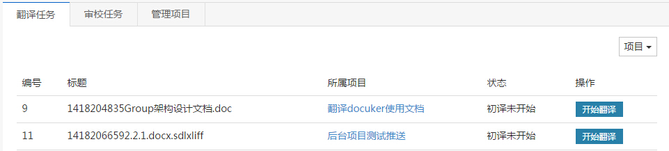
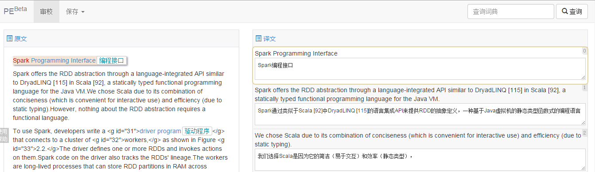
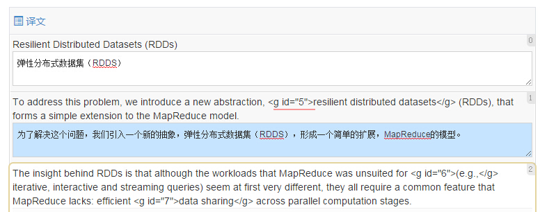
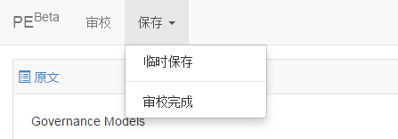

# 翻译操作指南 - 审校

### 报名

每个项目启动后，会在翻译平台、CODE资讯频道发起成员招募。请按招募说明选择你感兴趣的方式报名，并提交相关个人信息。

个人信息可能包括：CSDN ID，想要担任的翻译职务，个人介绍，联系方式等。

报名之后需要PM审核，一旦PM通过了你的报名请求，你将收到通知，并正式成为项目成员。

### 开始审校

在翻译平台首页点击“我的翻译”，进入你的任务列表。

点击“审校任务”菜单，可以看到待审校的任务列表。

其中，若有些任务的状态为“初译未开始”或“初译中”，则你暂时不能审校。必须等到任务状态变更为“初译结束”时，你才能在任务列表中看到“审校”的按钮。

此时，点击“审校”按钮，将进入任务详情页面。

如图， 页面左侧是待译任务的原文。右侧是翻译工具。

此时，你可以看到，右侧每句原文下面，已经有了译者翻译的中文内容。审阅这些内容，如果内容正确，无需处理，保持原样即可。如果内容有误，需要校对，直接点击该内容所在文本框，修改即可。

修改将会覆盖原来的内容，且不可恢复。修改后内容将自动保存。

**注意！** 如果文本框底色变为蓝色此时可能表示你的译文格式有问题，有可能保存不上，请特别注意。

关于格式问题，可参看“翻译细节说明”或咨询CODE客服（QQ:1799042606)。

### 结束审校

整个文件都审校结束后，点击翻译界面左上角导航的“保存” - “审校完成”。

。

状态为“审校结束”的文件不可再次修改。

若一个项目里所有文件的状态均为“审校结束”，则表示该项目已完结。

### 特别说明：

1. 译者应保证在项目规定时间内完成翻译/审校工作；

2. 若译者不能按时完成翻译/审校工作的，项目负责人或运营方有权更换译者。
