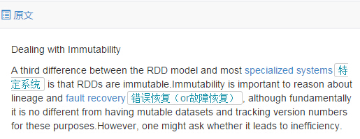
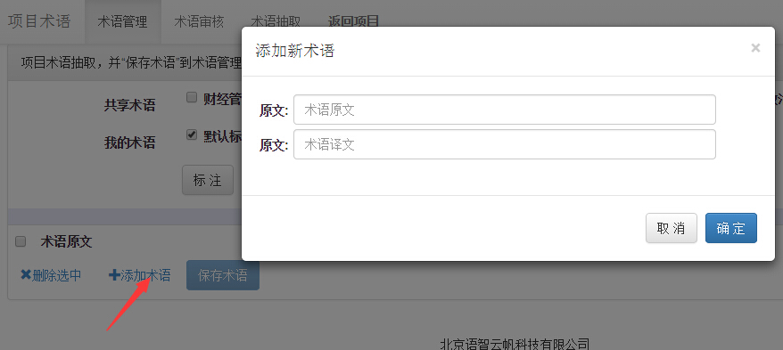
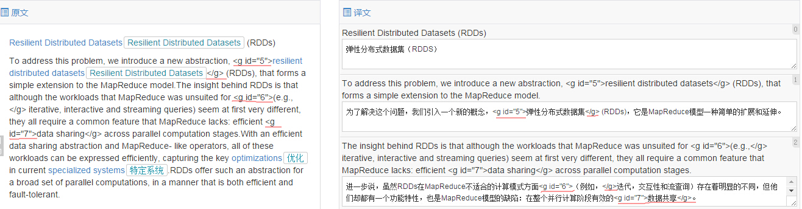
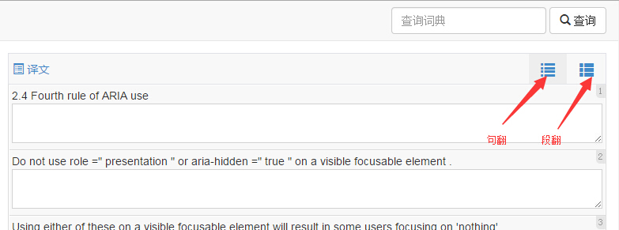

# 翻译细节说明

### 翻译术语
CSDN翻译平台会为所有文档提供一个通用的计算机术语库。这些术语在你进行翻译时，会在翻译页面左侧的原文中以突出色彩显示，并给出翻译提示。

除总的术语库外，每个项目还可以添加其独有的术语库。术语的添加可由PM来操作。

操作步骤：

1.进入项目管理后台点击“添加术语”，进入术语编辑后台

2.再次点击“添加术语”，在弹出窗口中填上要加的术语和术语翻译。

### 代码、图表等特殊格式处理

对于pdf、word等格式复杂的原文内容，会由“语智云帆”公司为这些内容做预处理。经过机器处理后的原文，其中可能会包含一些格式代码，形如`<g id="xx">`或`<x id="xx">`之类。这部分代码**翻译时请在译文里保留，以便译文能依靠这些代码欢迎为原来的格式和图表。** 如果代码没有保留，那么该段译文将无法保存成功（译文背景呈蓝色时，就表示格式有误，这时请仔细检查）。

如图，画红线部分的代码，需要在译文里原样呈现。若没有呈现，则文本框底色会变蓝，屏幕闪过提示“不规范节点”。

PS. 不是所有的文章里都有这些代码，遇到的话特别注意就是了。

### 句段切换

txt格式的翻译内容支持自定义切换按句翻译还是按段翻译。操作方式如下图：在翻译页面右上角有一个切换按钮。

需要注意的是，请在一开始就确定按句还是按段翻译。中途切换的话，之前切换的内容不会自动复制过去，而是继续保持在原模式下。

